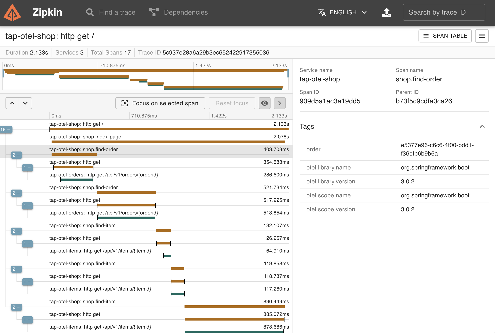
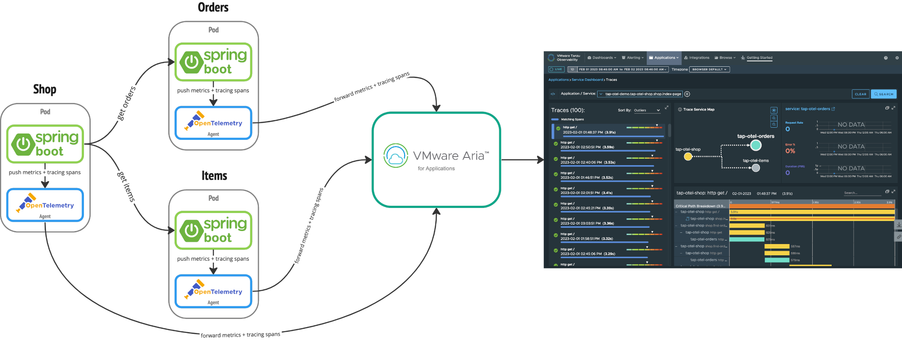
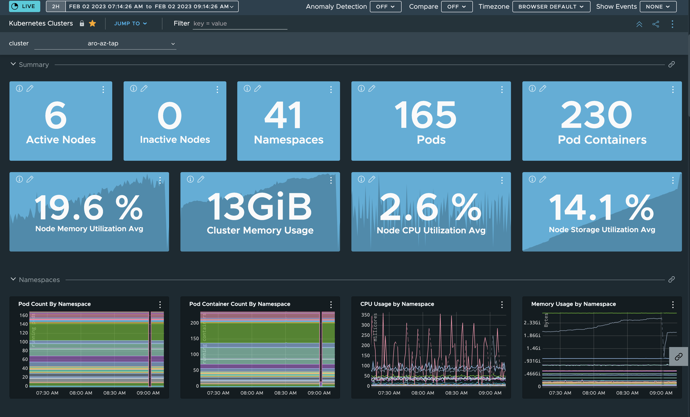
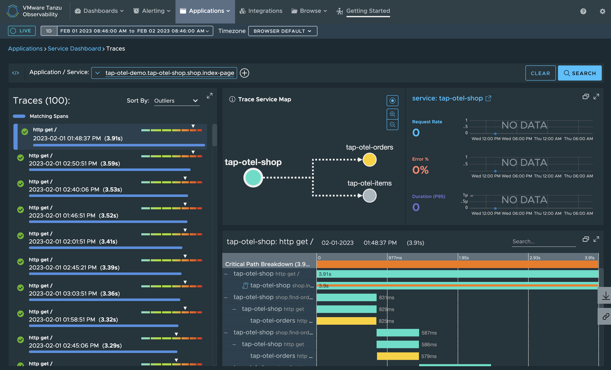
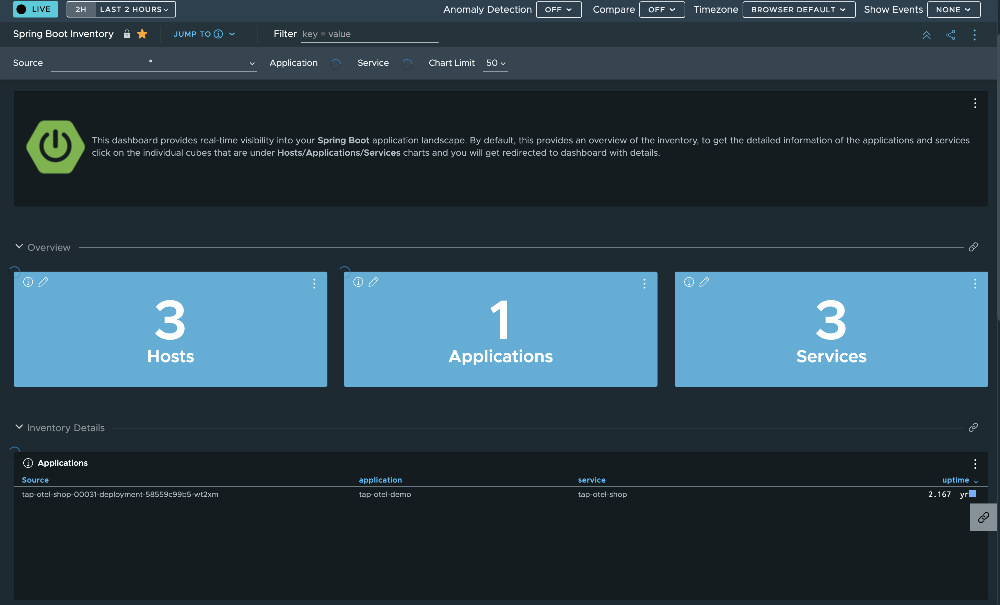
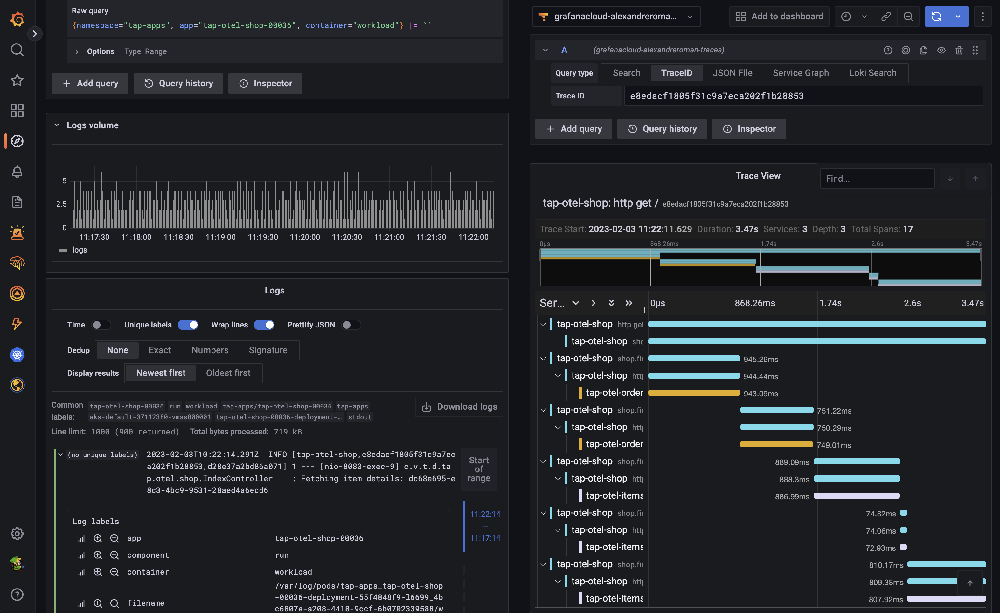

# OpenTelemetry with VMware Tanzu Application Platform

This project shows how to leverage
[OpenTelemetry](https://opentelemetry.io)
(a collection of tools, APIs, and SDKs you can use to instrument, generate, collect,
and export telemetry data) along with Tanzu Application Platform.

Thanks to OpenTelemetry, you can easily switch an observability solution to another one,
without having to change your source code.

Using this example, you can extract metrics and tracing spans out of
a Spring Boot based app. This app is deployed to a Tanzu Application Platform installation.
This project provides an OpenTelemetry configuration that you can use with
[VMware Aria for Applications](https://www.vmware.com/products/aria-operations-for-applications.html). By editing this configuration file only, you can switch Aria to something else,
without having to change the app.

## How to run this app?

This app is made of 3 modules:

- shop: the main entry point
- orders
- items

Run these commands to start the app and its modules:

```shell
mvn -pl shop spring-boot:run
```

```shell
mvn -pl orders spring-boot:run
```

```shell
mvn -pl items spring-boot:run
```

Tracing is disabled by default: you may want to start
[Zipkin](https://zipkin.io) on your workstation in order to collect tracing spans.
Just add `-Pdev` to the commands above when starting the app and its modules.

Use this command to start a Zipkin instance (you need a Docker daemon running):

```shell
docker run --rm -p 9411:9411 openzipkin/zipkin:latest
```

You can now hit this page at http://localhost:8080 and see the app in action.

```shell
curl localhost:8080
```

This command should return the following output:

```yaml
{
  title: "Welcome to SpringBootShop!",
  orders:
    [
      {
        orderId: "e5377e96-c6c6-4f00-bdd1-f36efb6b9b6a",
        customerId: "johndoe",
        state: "New",
        dueDate: "2022-11-14T09:13:30Z",
        items:
          [
            {
              itemId: "41a1c650-df66-46d0-b7fb-96a117c5dda7",
              title: "Hat: Spring Boot FTW",
              price: "100",
            },
            {
              itemId: "e5b6da9d-ba51-4119-b527-ace1aaa7985e",
              title: "Laptop sticker: I love Java",
              price: "15",
            },
          ],
      },
      {
        orderId: "998d14af-aac1-4082-8194-990a3c24f553",
        customerId: "bartsimpsons",
        state: "Canceled",
        dueDate: "2022-11-25T09:34:30Z",
        items:
          [
            {
              itemId: "dc68e695-e8c3-4bc9-9531-28aed4a6ecd6",
              title: "T-shirt: Kubernetes is boring",
              price: "27",
            },
          ],
      },
    ],
}
```

Orders entities are returned by the `orders` module.
Order items are managed by the `items` module.

Go to http://localhost:9411 to use Zipkin and see the network requests
between the different app modules:



Those network requests have been instrumented thanks to
[Micrometer metrics](https://micrometer.io) and
[Micrometer Tracing](https://micrometer.io/docs/tracing)
(a Java library for handling metrics and tracing spans).

Metrics are available through an OpenTelemetry receiver:
when a collector is running on `localhost:4318/v1/metrics`, metrics are
periodically pushed to this instance. Note that this feature is disabled by default in the app.

## Deploy this app to Tanzu Application Platform

First of all, you need to deploy Aria to your Kubernetes cluster.

If you need help, use these commands to deploy Aria:

```shell
kubectl apply -f config/platform-operator/wavefront-ns.yaml -f config/platform-operator/wavefront-pvc.yaml
export WAVEFRONT_API=https//XXX.wavefront.com
export WAVEFRONT_TOKEN=<token>
envsubst < config/platform-operator/charts/wavefront-values.yaml > /tmp/wavefront-values.yaml
helm upgrade wavefront -n wavefront --install --version 4.2.10 -f /tmp/wavefront-values.yaml bitnami/wavefront
```

Next, you need to deploy OpenTelemetry Operator for Kubernetes:

```shell
helm repo add open-telemetry https://open-telemetry.github.io/opentelemetry-helm-charts
helm repo update
helm upgrade opentelemetry-operator -n opentelemetry-operator-system --create-namespace --install --version 0.21.4 --set manager.collectorImage.tag=0.70.0 open-telemetry/opentelemetry-operator
```

At this point, you can deploy an OpenTelemetry Collector to your TAP developer
namespace (`$TAP_NS`):

```shell
kubectl apply -f config/app-operator/otel-aria.yaml -n $TAP_NS
```

This collector is responsible for forwarding metrics and tracing spans
(sent by the app) to Aria.
If you need to change your observability solution, you only need to update
the OpenTelemetry Collector configuration file:

```yaml
apiVersion: opentelemetry.io/v1alpha1
kind: OpenTelemetryCollector
metadata:
  name: otel
spec:
  mode: sidecar
  config: |
    receivers:
      otlp:
        protocols:
          grpc:
          http:
      zipkin:

    processors:
      batch:
        timeout: 10s
      memory_limiter:
        check_interval: 1s
        limit_percentage: 50
        spike_limit_percentage: 30
      resource:
        attributes:
        - key: application
          value: tap-otel-demo
          action: upsert

    exporters:
      logging:
        logLevel: info
      tanzuobservability:
        traces:
          endpoint: http://wavefront-proxy.wavefront.svc.cluster.local:2878
        metrics:
          endpoint: http://wavefront-proxy.wavefront.svc.cluster.local:2878
    service:
      pipelines:
        traces:
          receivers: [zipkin]
          processors: [resource, memory_limiter, batch]
          exporters: [tanzuobservability, logging]
        metrics:
          receivers: [otlp]
          processors: [resource, memory_limiter, batch]
          exporters: [tanzuobservability, logging]
```

You're finally ready to deploy the app:

```shell
kubectl apply -f config/workloads.yaml -n $TAP_NS
```

You're done!

The app should be built and deployed by TAP. Note that pods have one more container:
the OpenTelemetry sidecar agent. As soon as an app module starts, it would connect to
the agent, periodically pushing metrics and tracing spans. The agent collects those
information, and then takes care of forwarding everything to Aria.



From a developer perspective, you have (almost) nothing to do.
As a Spring Boot developer, just add these dependencies for OpenTelemetry support:

```xml
<dependency>
    <groupId>io.micrometer</groupId>
    <artifactId>micrometer-registry-otlp</artifactId>
</dependency>
<dependency>
    <groupId>io.micrometer</groupId>
    <artifactId>micrometer-tracing-bridge-otel</artifactId>
</dependency>
<dependency>
    <groupId>io.opentelemetry</groupId>
    <artifactId>opentelemetry-exporter-zipkin</artifactId>
</dependency>
```

Micrometer and Spring Boot will send metrics and tracing spans to local services by default
(127.0.0.1), which is fine since the OpenTelemetry Collector agent is running as a sidecar
in the resulting container. This pattern is interesting because the app can offload
metrics and tracing spans to the agent without having to know what to do with
the observability data actually.

Note that the app is not aware of Aria: metrics and tracing spans are pushed to the
OpenTelemetry Collector agent. This is why OpenTelemetry is a great technology,
since you can plug your favorite observability solution with no impact on source code.

[See this page](https://docs.spring.io/spring-boot/docs/current/reference/html/actuator.html#actuator.metrics.export.otlp)
for more information about Spring Boot and OpenTelemetry support.

Of course, you can use your favorite framework and language with OpenTelemetry!

## Visualize data collected by OpenTelemetry with Aria

Metrics and tracing spans are expected to land on Aria by now.

With Aria you'll find ready-to-use dashboards, so that you can visualize data
from your Kubernetes clusters and the apps:







## Visualize data collected by OpenTelemetry with Grafana Cloud

What about changing your observability solution?

Let's switch to [Grafana Cloud](https://grafana.com/products/cloud) instead of Aria.

Create an account (you can use the free trial), and then create an API key.

Get the following information from your account dashboard:

```shell
export GRAFANA_CLOUD_API_KEY=your-api-key
export GRAFANA_CLOUD_ZONE=your-instance-zone
export GRAFANA_CLOUD_INSTANCE_ID=your-instance-id
```

You can now update the OpenTelemetry Collector configuration:

```shell
envsubst < config/app-operator/otel-grafana-cloud.yaml | kubectl apply -f- -n $TAP_NS
```

As soon as you restart your pods, a new OpenTelemetry Collector agent would run as a sidecar
in pods, collecting metrics and tracing spans, and forwarding these information to
Grafana Cloud. And you didn't have to make any updates to your app!

Moreover, you can also collect logs out of your apps with Grafana Cloud.

Get these information first:

```shell
export GRAFANA_CLOUD_LOKI_USER=your-loki-user
```

Then deploy Promtail, a component which is responsible for collecting logs from pods:

```shell
helm repo add grafana https://grafana.github.io/helm-charts
helm repo update
envsubst < config/platform-operator/charts/promtail-values.yaml > /tmp/promtail-values.yaml
helm upgrade promtail -n promtail --create-namespace --install --version 6.8.2 -f /tmp/promtail-values.yaml grafana/promtail
```

In a few minutes, you'll be able to see logs, metrics and tracing spans in Grafana Cloud!



Hope it helps!

## Contribute

Contributions are always welcome!

Feel free to open issues & send PR.

## License

Copyright &copy; 2023 [VMware, Inc. or its affiliates](https://vmware.com).

This project is licensed under the [Apache Software License version 2.0](https://www.apache.org/licenses/LICENSE-2.0).
